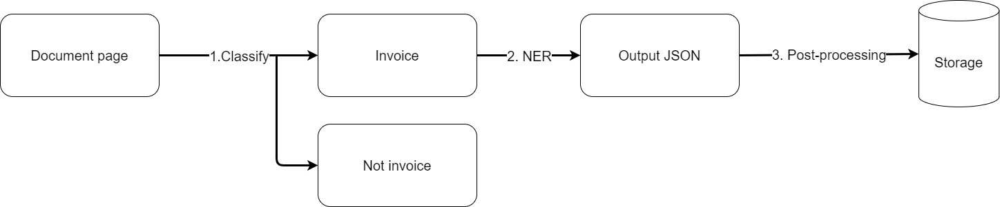

# InvoiceXpert🧾🧠 - Your invoice data, unleashed

## About

InvoiceXpert is a project to create a tool that can extract data from invoices. The goal is to create a tool that can extract data from invoices in a variety of formats, including PDFs, images, and scanned documents. The tool will be able to extract data such as the biller, invoice number, date and total amount. 

The project started as a demonstration app for the workshop [End-to-End AI App Engineering with Open Source](https://www.meetup.com/machine-learning-meetup-kosice/events/298773899/), and it's secondary goal is to serve as a learning resource on AI-powered applications for (not only) the workshop participants.

## Features

- **[Custom dataset for classification](https://huggingface.co/datasets/wiF0n/invoiceXpert)**: The dataset is a amalgamation of two datasets, namely subset of [rvl_cdip](https://huggingface.co/datasets/jinhybr/rvl_cdip_400_train_val_test) and [FATURA2 invoice dataset](https://huggingface.co/datasets/mathieu1256/FATURA2-invoices) datasets. It contains images of invoices and non-invoices. The dataset is used to train a model to classify whether a document is an invoice or not.
- **Invoice classification**: Classify whether a document is an invoice or not. Currently, I tested different fine-tunning strategies (full-ft, LORA-ft) of the [DiT-base ft](https://huggingface.co/microsoft/dit-base-finetuned-rvlcdip) models and also the ft model itself. More details can be found in the [Out-of-box notebook](notebooks/test_oob_models.ipynb), [Full Fine-tunning notebook](notebooks/train_custom_model.ipynb) and [LORA finetuning notebook](notebooks/train_custom_lora_model.ipynb), as well as in the mlflow experiment (type `mlflow ui` in your terminal). Note that the classification models are not yet integrated into the main pipeline nor are they pushed to the Hugging Face model hub.
- **Data extraction**: Extract data from invoices. The data extraction is done using the [Invoice FT LayoutLMv3](https://huggingface.co/Theivaprakasham/layoutlmv3-finetuned-invoice) model.

Below you can see the main process diagram of the project:

## Main tools and technologies

- [Hugging Face](https://huggingface.co/) – models, datasets and LORA PEFT
- [Hydra](https://hydra.cc/) – configuration framework
- [MLflow](https://mlflow.org/docs/latest/index.html) – experiment tracking and model lifecycle (MLOps)

## Current state

This project is currently in the early stages of development. The extraction functionality has been tested on a small number of invoices. So you can expect to see some bugs, inconsistencies, and inaccuracies both in code and results.

